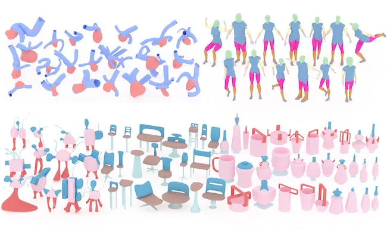

# **A Task-driven Network for Mesh Classification and Semantic Part Segmentation**

### [Project](https://qiujiedong.github.io/publications/TaskDrivenNet2Mesh/) | [Paper](https://arxiv.org/abs/2306.05246)

**This repository is the official PyTorch implementation of our paper,  *A Task-driven Network for Mesh Classification and Semantic Part Segmentation*.**



## Requirements

- I appreciate your interest in our work. Since I have other work to do recently, the code will be made public shortly.

## Cite

If you find our work useful for your research, please consider citing the following papers :)

```bibtex
@article{Dong2024TaskDrivenNet2Mesh,
author={Dong, Qiujie and Gong, Xiaoran and Xu, Rui and Wang, Zixiong and Gao, Junjie and Chen, Shuangmin and Xin, Shiqing and Tu, Changhe and Wang, Wenping},
journal={arXiv},
title={A Task-driven Network for Mesh Classification and Semantic Part Segmentation},
year={2023},
keywords = {Geometric Deep Learning, Mesh Classification, Semantic Part Segmentation, Task-driven Neural Network}
}
```


## Acknowledgments
Our code is inspired by [Laplacian2Mesh](https://github.com/QiujieDong/Laplacian2Mesh) and [DiffusionNet](https://github.com/nmwsharp/diffusion-net)
